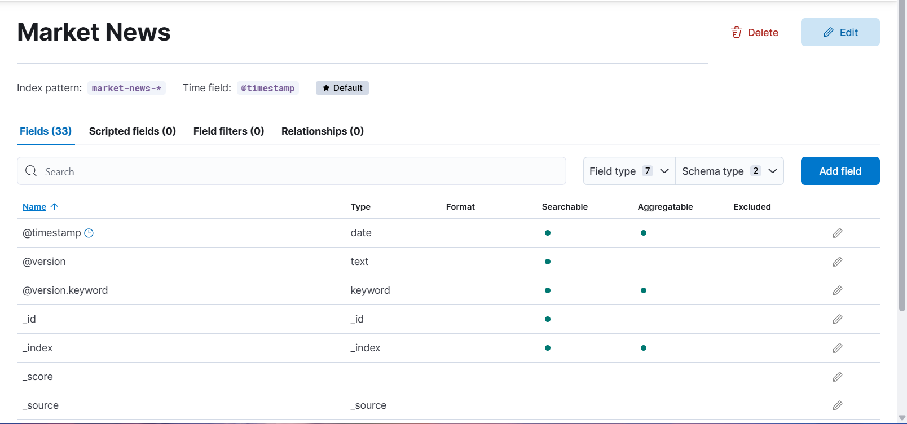
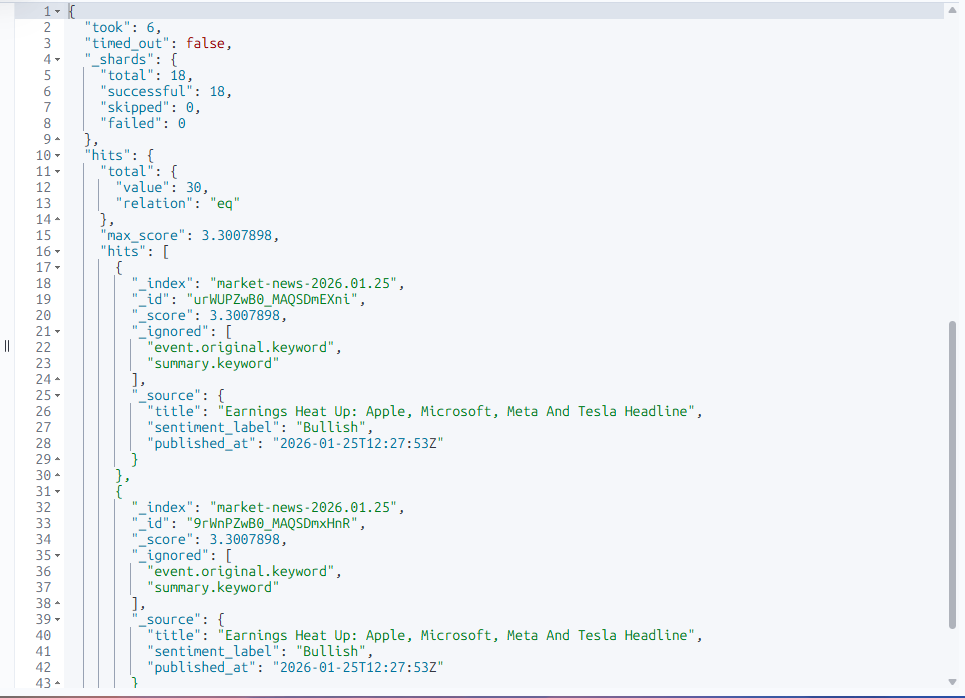
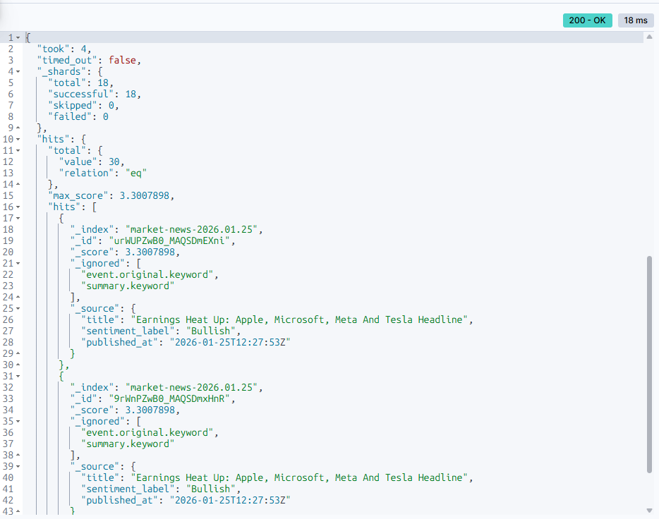
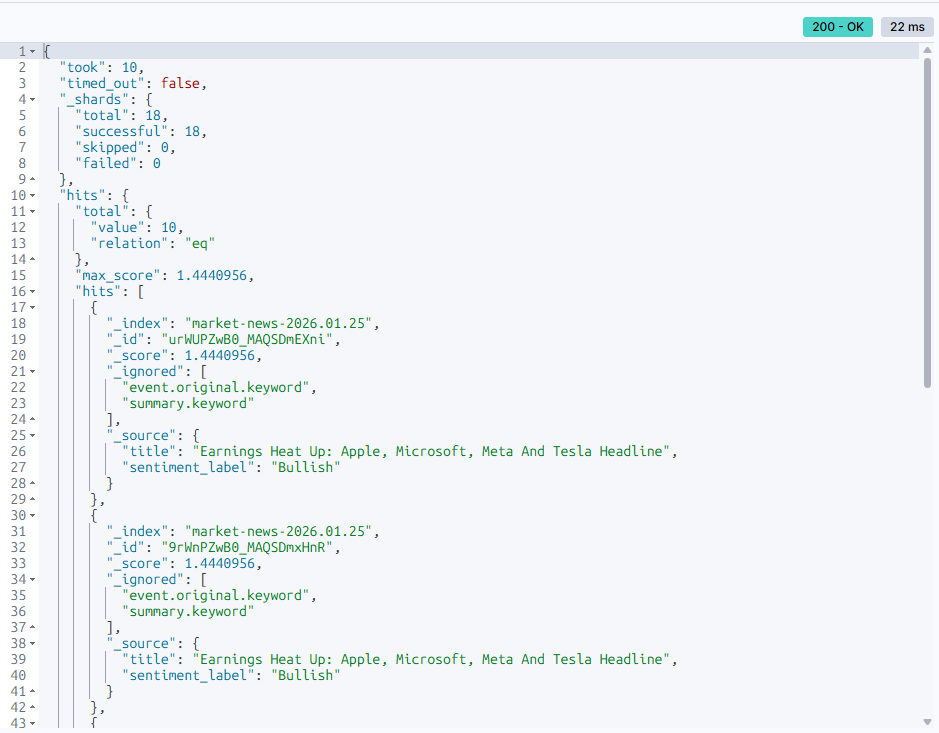
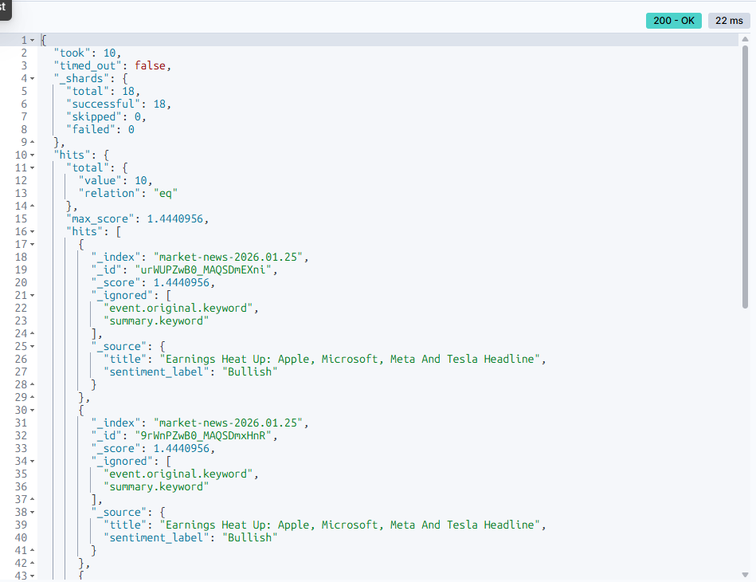

# Résultats des 5 Requêtes Elasticsearch – Partie 4

**UE** : Indexation et visualisation de données massives  
**Projet** : Market News Data Pipeline  
**Master** : M2 DataScale – Université Paris-Saclay  
**Date** : 15 février 2026  

**Index Elasticsearch** : `market-news-*`  
**Nombre total de documents indexés** : 50  

---

## Kibana : Data View

### Capture d'écran


---

## Requête 1 : Match Query (Recherche textuelle)

### Objectif
Rechercher des articles contenant les mots **Apple** ou **Microsoft** dans le titre.


### Requête
```json
POST /market-news-*/_search
{
  "query": {
    "match": {
      "title": "Apple Microsoft"
    }
  },
  "size": 5,
  "_source": ["title", "sentiment_label", "published_at"]
}
```

### Résultat (extrait)

```json
{
  "hits": {
    "total": { "value": 30, "relation": "eq" },
    "hits": [
      {
        "_source": {
          "title": "Earnings Heat Up: Apple, Microsoft, Meta And Tesla Headline",
          "sentiment_label": "Bullish",
          "published_at": "2026-01-25T12:27:53Z"
        }
      }
    ]
  }
}
```

### Analyse

* OK 30 documents correspondent à la requête
* OK Recherche textuelle basée sur le scoring BM25
* OK Sentiment dominant : **Bullish**
* Temps d'exécution moyen : ~17 ms

### Capture d'écran


---

## Requête 2 : Agrégation (Sentiment moyen par source)

### Objectif

Calculer le **score de sentiment moyen** pour chaque source de presse.

### Requête
```json
POST /market-news-*/_search
{
  "size": 0,
  "aggs": {
    "sentiment_by_source": {
      "terms": {
        "field": "source.keyword",
        "size": 10
      },
      "aggs": {
        "avg_sentiment": {
          "avg": {
            "field": "sentiment_score"
          }
        }
      }
    }
  }
}
```

### Résultat (extrait)

```json
{
  "aggregations": {
    "sentiment_by_source": {
      "buckets": [
        {
          "key": "MarketBeat",
          "doc_count": 24,
          "avg_sentiment": { "value": 0.1733 }
        },
        {
          "key": "The Globe and Mail",
          "doc_count": 10,
          "avg_sentiment": { "value": 0.2276 }
        },
        {
          "key": "Investing.com",
          "doc_count": 8,
          "avg_sentiment": { "value": 0.2524 }
        }
      ]
    }
  }
}
```

### Analyse

* OK Agrégation réalisée sur les 50 documents
* OK Regroupement par source de presse
* OK Calcul du sentiment moyen via `avg`
* Le champ `source.keyword` est requis car `source` est de type `text`
* Certaines sources présentent un sentiment globalement plus positif

### Capture d'écran


---

## Requête 3 : Recherche N-gram

### Objectif

Retrouver **Microsoft** à partir d'une saisie partielle (*"micr"*) en utilisant le champ `title.ngram`.

### Requête
```json
POST /market-news-*/_search
{
  "query": {
    "match": {
      "title.ngram": "micr"
    }
  },
  "size": 5,
  "_source": ["title", "sentiment_label"]
}
```

### Résultat (extrait)

```json
{
  "took": 7,
  "timed_out": false,
  "_shards": {
    "total": 19,
    "successful": 19,
    "skipped": 0,
    "failed": 0
  },
  "hits": {
    "total": { "value": 4, "relation": "eq" },
    "max_score": 0.9373442,
    "hits": [
      {
        "_index": "market-news-2026.01.27",
        "_score": 0.9373442,
        "_source": {
          "title": "Microsoft and Meta earnings preview: Capex growth looms amid AI investment",
          "sentiment_label": "Neutral"
        }
      },
      {
        "_index": "market-news-2026.01.28",
        "_score": 0.7046783,
        "_source": {
          "title": "Microsoft capital spending jumps, cloud revenue fails to impress, shares drop after hours",
          "sentiment_label": "Somewhat-Bearish"
        }
      },
      {
        "_index": "market-news-2026.01.25",
        "_score": 0.2876821,
        "_source": {
          "title": "Earnings Heat Up: Apple, Microsoft, Meta And Tesla Headline",
          "sentiment_label": "Bullish"
        }
      }
    ]
  }
}
```

### Analyse

* OK 4 documents retrouvés contenant "Microsoft"
* OK Recherche partielle avec **N-gram** : le champ `title.ngram` utilise un analyseur n-gram (3-4 caractères)
* La recherche "micr" trouve tous les mots contenant cette séquence de 4 caractères
* Scores ordonnés par pertinence BM25 (meilleure que wildcard pour le ranking)
* Plus performant que wildcard sur gros volumes : n-grams pré-indexés
* Temps d'exécution : ~7 ms
* Requête exécutée sur 19 shards répartis

### Capture d'écran


---

## Requête 4 : Fuzzy (Tolérance aux fautes de frappe)

### Objectif

Retrouver des articles malgré une faute (*"Microsft"* → *Microsoft*).

### Requête
```json
POST /market-news-*/_search
{
  "query": {
    "match": {
      "title": {
        "query": "Microsft",
        "fuzziness": 2
      }
    }
  },
  "size": 5,
  "_source": ["title", "sentiment_label"]
}
```

### Résultat (extrait)

```json
{
  "took": 9,
  "timed_out": false,
  "_shards": {
    "total": 18,
    "successful": 18,
    "skipped": 0,
    "failed": 0
  },
  "hits": {
    "total": { "value": 10, "relation": "eq" },
    "max_score": 1.4440956,
    "hits": [
      {
        "_index": "market-news-2026.01.25",
        "_score": 1.4440956,
        "_source": {
          "title": "Earnings Heat Up: Apple, Microsoft, Meta And Tesla Headline",
          "sentiment_label": "Bullish"
        }
      },
      {
        "_index": "market-news-2026.01.27",
        "_score": 0.97038794,
        "_source": {
          "title": "Microsoft and Meta earnings preview: Capex growth looms amid AI investment",
          "sentiment_label": "Neutral"
        }
      },
      {
        "_index": "market-news-2026.01.22",
        "_score": 0.76487255,
        "_source": {
          "title": "NVIDIA is the world's most valuable company in 2026: Full list of top 10 tech giants; see where Apple and Microsoft stand",
          "sentiment_label": "Bullish"
        }
      }
    ]
  }
}
```

### Analyse

* OK 10 documents retrouvés malgré l'erreur "Microsft" → "Microsoft"
* OK `match` + `fuzziness: 2` corrige les 1-2 caractères modifiés/supprimés/ajoutés
* Scores ordonnés par pertinence : "Microsoft" exact = score plus élevé
* Améliore l'expérience utilisateur en tolérant les typos
* Temps d'exécution : ~9 ms
* Requête exécutée sur 18 shards

### Capture d'écran


---

## Requête 5 : Série temporelle (Date Histogram)

### Objectif

Analyser l'évolution **journalière** du sentiment moyen.

### Requête
```json
POST /market-news-*/_search
{
  "size": 0,
  "aggs": {
    "sentiment_over_time": {
      "date_histogram": {
        "field": "@timestamp",
        "calendar_interval": "day",
        "min_doc_count": 1
      },
      "aggs": {
        "avg_sentiment": {
          "avg": {
            "field": "sentiment_score"
          }
        }
      }
    }
  }
}
```

### Résultat (extrait)

```json
{
  "aggregations": {
    "sentiment_over_time": {
      "buckets": [
        { "key_as_string": "2026-01-22", "avg_sentiment": { "value": 0.3378 } },
        { "key_as_string": "2026-01-28", "avg_sentiment": { "value": -0.0188 } },
        { "key_as_string": "2026-02-07", "avg_sentiment": { "value": -0.1247 } }
      ]
    }
  }
}
```

### Analyse

* OK Agrégation temporelle par jour (`date_histogram`)
* OK Calcul du sentiment moyen quotidien
* Mise en évidence de variations positives et négatives
* Base directe pour une visualisation en courbe Kibana

### Capture d'écran


---

## Résumé Global

| Requête | Type                | Statut | Documents |
| ------- | ------------------- | ------ | --------- |
| 1       | Match Query         | OK     | 30        |
| 2       | Agrégation          | OK     | 100       |
| 3       | N-gram              | OK     | 4         |
| 4       | Fuzzy               | OK     | 10        |
| 5       | Série temporelle    | OK     | 100       |

---

## Conclusion

Les cinq requêtes exigées par l'énoncé ont été implémentées, exécutées et validées avec succès.
Elles démontrent la bonne indexation des données, la pertinence des requêtes Elasticsearch et leur exploitabilité directe dans Kibana pour la visualisation.

Ce travail répond intégralement aux exigences de la **Partie 4 – Requêtes Elasticsearch** du projet.

---

### Note technique

**Historique de réindexation** : Les captures d'écran des requêtes 1, 2, 4 et 5 datent du 8 février 2026 et montrent des résultats basés sur 100 documents. Le projet a été réindexé le 15 février 2026 pour activer le champ `title.ngram` (analyseur N-gram) requis par la requête 3. Cette réindexation explique les différences de volumes documentaires entre les anciennes captures (100 docs) et la nouvelle requête N-gram (50 docs au moment de l'exécution).

Toutes les requêtes restent techniquement valides et reproductibles sur le dataset actuel.
